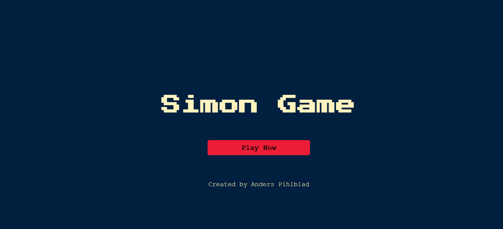
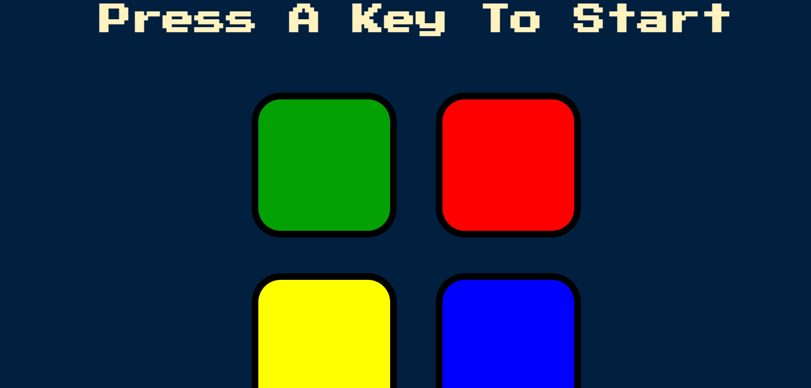
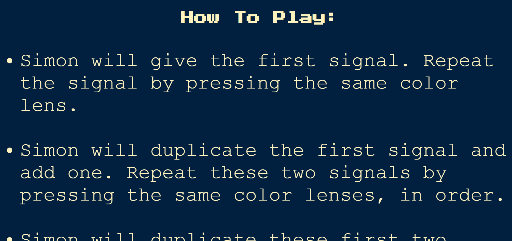
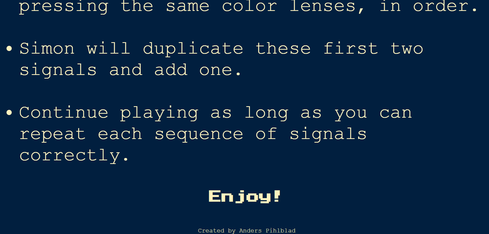
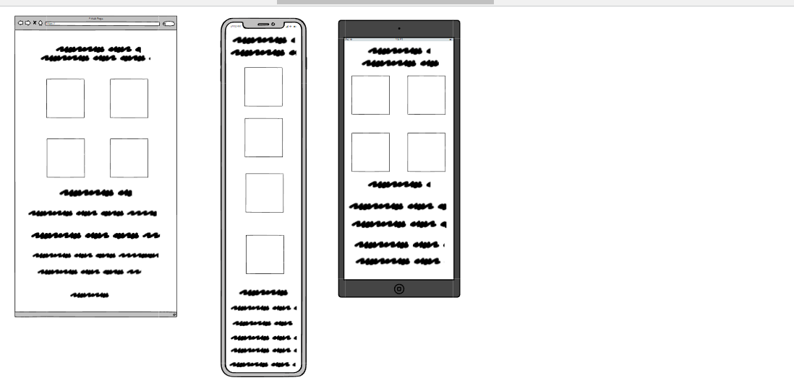
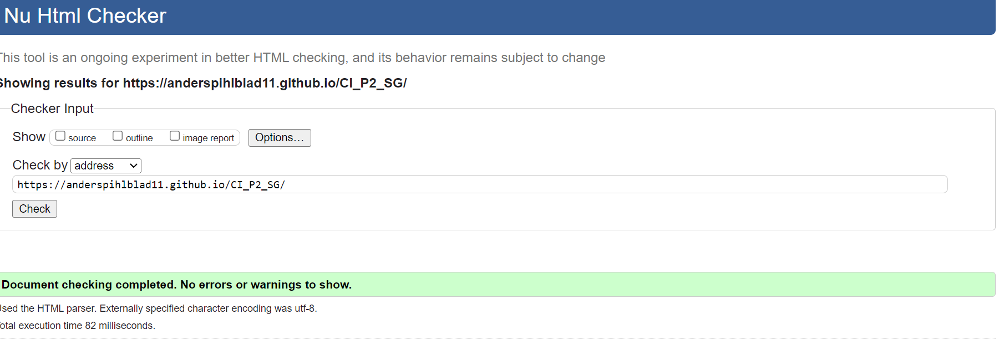
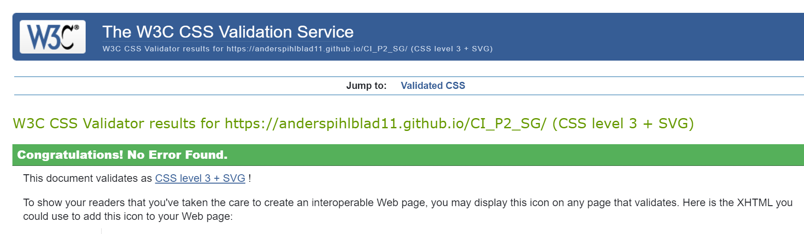
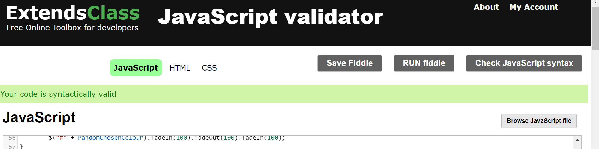
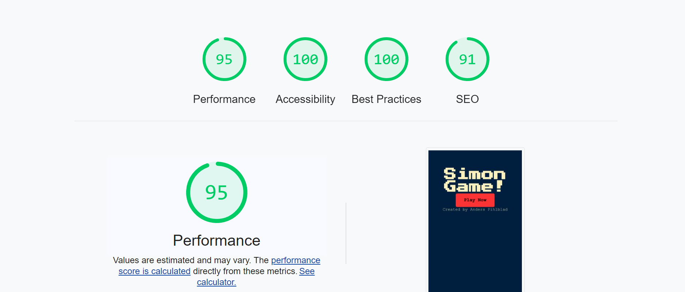

# Simon Game
(Developer: Anders Pihlblad)

[Live webpage](https://anderspihlblad11.github.io/CI_P2_SG/)

## intro
The website is based off the popular game called simon game which challenges the players memory skills with sequences that have to be copied to get to the next stage. Its great for memory training and a laugh with friends and family. 

## Table of Content

1. [Project Goals](#project-goals)
    1. [User Goals](#user-goals)
    2. [Site Owner Goals](#site-owner-goals)
2. [User Experience](#user-experience)
    1. [Target Audience](#target-audience)
    2. [User Requirements and Expectations](#user-requirements-and-expectations)
    3. [User Stories](#user-stories)
3. [Design](#design)
    1. [Design Choices](#design-choices)
    2. [Fonts](#fonts)
    3. [Wireframes](#wireframes)
4. [Technologies Used](#technologies-used)
    1. [Languages](#languages)
    2. [Frameworks & Tools](#frameworks-&-tools)
5. [Testing](#validation)
    1. [HTML Validation](#HTML-validation)
    2. [CSS Validation](#CSS-validation)
    3. [Performance](#performance)
    4. [Device testing](#performing-tests-on-various-devices)
5. [References](#references)

## Project Goals 

### User Goals
- Good for training memory.
- A good social game to play with friends and family.
- Smooth game play.

### Site Owner Goals
- Have eye catching colours.
- A smooth flow.
- A fun interactive experience for the users.

## User Experience

### Target Audience
- People looking for a challenge.
- Children.
- People at gatherings with friends or family.

### User Requirements and Expectations

- Flowing and easy to understand layout.
- Good presentation and visually appealing regardless of screen size.
- Detailed description of how to play.

### User Stories
1. As a user, I want to know what to expect.
2. As a user, I want to know how to play.
3. As a user, I want range regarding the levels.
4. As a user, I want a challenge.

#### Site Owner 
6. As the site owner, I want to keep the user engaged.
7. As the site owner, I want users to enjoy the site.

## Design

### Design Choices
The webpage was designed to have a simplistic retro gaming experience.

First Page

Game Page 1

Game Page 2

Game Page 3

### Fonts
The fonts I used were Courier New for the body and Press Start 2P for headings. I used Google fonts to extract both.

### Wireframes

First Page Wireframe

Second Page Wireframe

## Technologies Used

### Languages
- HTML
- CSS
- java Script
- JQuery

### Frameworks & Tools
- Git
- GitHub
- Gitpod
- Color Hunt
- Balsamiq
- Google Fonts
- VS code
- Font Awsome

## Validation

### HTML Validation
The Nu html checker Service was used to validate the HTML of the website. 

HTML

### CSS Validation
The W3C Jigsaw CSS Validation Service was used to validate the CSS of the website.

style.css

### JaveScript Validation
The Extends Class Validation Service was used to validate the JavaScript of the website.

index.js

### Performance 
web.dev was used to test the performance of the website. 

Whole page

### Performing tests on various devices 
The website was tested on the following devices:
- lenovo laptop
- iphone 13
- iphone 5

### References
- udemy previous coarse I have taken.
- Stack over flow
- W3 schools
- My good friend Daniel.

